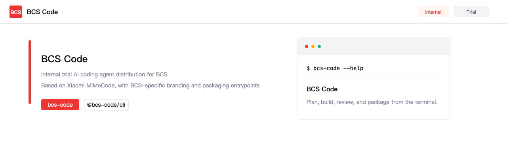

<h1 align="center">BCS Code</h1>

<p align="center">
  
</p>

<p align="center"><strong>面向 BCS 内部试用的 AI 编程智能体发行版。</strong></p>

<p align="center">
  中文 | <a href="README.md">English</a>
</p>

<p align="center">
  <a href="https://mimo.xiaomi.com/zh/mimocode">上游官网</a> | <a href="https://mimo.xiaomi.com/zh/blog/mimo-code-long-horizon">上游博客</a>
</p>

---

BCS Code 是基于小米 MiMoCode 的内部试用发行版，而 MiMoCode 基于 OpenCode 构建。本内部发行版保留上游核心能力，仅针对 BCS 内测做品牌和打包入口调整。

内置 MiMo Auto 限时免费通道——零配置即可开始使用。也支持接入各家主流 LLM 厂商 API。

---

## 快速开始

```bash
# 构建当前平台二进制
cd packages/opencode
OPENCODE_VERSION=0.1.0-bcs.1 ./script/build.ts --single
cd ../..

# 在 Apple Silicon macOS 安装本地二进制
./install --binary packages/opencode/dist/bcs-code-darwin-arm64/bin/bcs-code

# 规划中的内网 npm registry 安装路径
npm install -g @bcs-code/cli
```

安装后运行 `bcs-code`。首次启动自动引导配置。支持：
- **MiMo Auto（限时免费）** — 匿名通道，零配置
- **小米 MiMo 平台** — OAuth 登录
- **从 Claude Code 导入** — 一键迁移已有认证
- **自定义 Provider** — TUI 内添加任意 OpenAI 兼容 API

---

## 核心特性

### 多智能体

| 智能体 | 说明 |
|--------|------|
| **build** | 默认。完整工具权限，用于开发 |
| **plan** | 只读分析模式，适合代码探索和方案设计 |
| **compose** | 编排模式，适合 specs-driven 开发和 Skill 驱动流程 |

按 `Tab` 在主智能体间切换。子智能体由系统按需生成。

### 持久化记忆

基于 SQLite FTS5 全文搜索的跨会话记忆：

- **项目记忆** (`MEMORY.md`) — 跨会话持久的项目知识、规则、架构决策
- **会话检查点** (`checkpoint.md`) — 结构化状态快照，由 checkpoint-writer 子智能体自动维护
- **笔记暂存** (`notes.md`) — Agent 临时记录区
- **任务进展** (`tasks/<id>/progress.md`) — 逐任务日志

记忆自动在会话恢复时注入上下文，agent 无需重新理解项目背景。

### 智能上下文管理

- **自动检查点** — 根据模型上下文窗口自动决定什么时候保存会话状态
- **上下文重建** — 当上下文接近上限时，从最新 checkpoint、项目记忆、任务进展和保留的近期消息重建上下文，让 agent 继续当前任务
- **预算化注入** — 用 token budget 控制 checkpoint / memory / notes 注入上下文的大小，按重要性排序

### 任务追踪

树状任务系统（T1, T1.1, T1.2…），自动与检查点系统联动，恢复会话时任务进度不丢失。

### 子智能体系统

主智能体可按需生成子智能体，共享当前会话上下文并行工作，支持生命周期追踪、取消机制和后台执行。

### Goal / 停止条件

`/goal` 命令为会话设置停止条件。当 agent 想停下来时，由独立裁判模型评估对话内容，判断条件是否真正满足——防止自主工作中的"乐观停止"。

### Compose 编排模式

Compose 模式提供结构化的 specs-driven 开发流程，内置规划、执行、代码审查、TDD、调试、验证、合并等技能——编排从 spec 到交付的完整开发生命周期。

### 语音输入

基于 TenVAD 和 MiMo ASR 的实时流式语音输入。通过 `/voice` 激活，按停顿分片转写，文本逐段追加到输入框。仅对 MiMo 登录用户可用。

### Dream & Distill

- **`/dream`** — 扫描近期会话轨迹，提取持久知识到项目记忆，清理过时条目
- **`/distill`** — 发现近期工作中重复的手动工作流，将高置信度候选打包成可复用的 skill、subagent 或 command

---

## 配置

BCS Code 当前保留上游 MiMoCode 配置路径：项目目录下的 `.mimocode/mimocode.json`，或全局 `~/.config/mimocode/mimocode.json`。主要选项包括：

- Provider 和模型选择
- Agent 权限和自定义 Agent
- 检查点和记忆行为
- MCP 服务器连接
- 快捷键和主题

Max Mode（并行 best-of-N 推理 + 裁判选优）可通过配置中的 `experimental.maxMode` 开启。

---

## 开发

```bash
bun install              # 安装依赖
bun run dev              # 开发模式运行
bun turbo typecheck      # 类型检查
```

---

## 与 Xiaomi MiMoCode 和 OpenCode 的关系

BCS Code 基于小米 MiMoCode 构建，而 MiMoCode 基于 [OpenCode](https://github.com/anomalyco/opencode) fork 构建。BCS Code 保留上游核心能力（多 Provider、TUI、LSP、MCP、插件、记忆、子智能体、Compose 工作流和 dream/distill），只调整内部试用所需的品牌和打包入口。

---

## 社区

扫描二维码加入社区群聊：

<p align="center">
  
  &nbsp;&nbsp;
  
</p>

---

## 许可证

源代码基于 [MIT 许可证](./LICENSE) 开源。

使用 BCS Code 还需遵守[使用限制](./USE_RESTRICTIONS.md)。
使用小米 MiMo 托管服务须遵守 [MiMo 服务条款](https://platform.xiaomimimo.com/docs/terms/user-agreement)。
使用 MiMo 名称、标志和商标须遵守 MiMo 商标政策。
